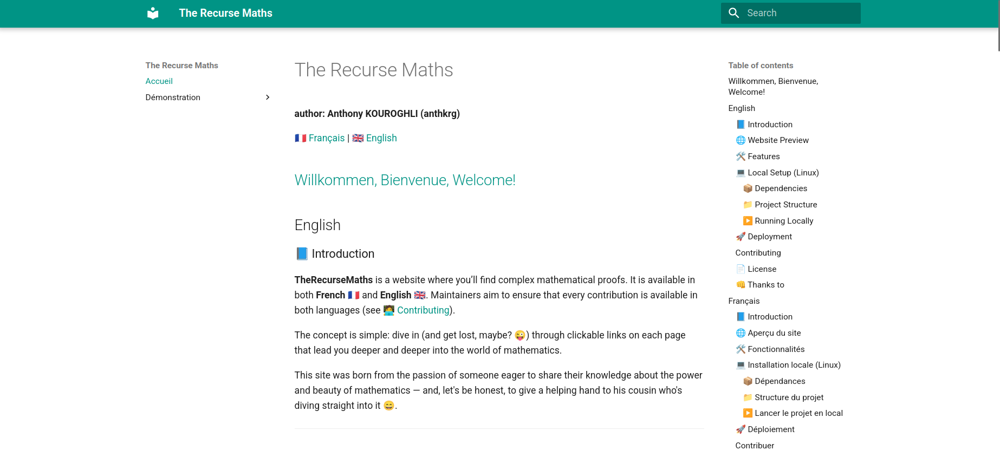

# The Recurse Maths
**author: Anthony KOUROGHLI (anthkrg)**

:fr: [Français](#français) | :uk: [English](#english)

## [Willkommen, Bienvenue, Welcome! (Click Me !)](https://www.youtube.com/watch?v=IqeMMN6aeJE)


## English

### 📘 Introduction

**TheRecurseMaths** is a website where you’ll find complex mathematical proofs. It is available in both **French** 🇫🇷 and **English** 🇬🇧. Maintainers aim to ensure that every contribution is available in both languages (see [🧑‍💻 Contributing](#contributing)).

The concept is simple: dive in (and get lost, maybe? 😜) through clickable links on each page that lead you deeper and deeper into the world of mathematics.

This site was born from the passion of someone eager to share their knowledge about the power and beauty of mathematics — and, let's be honest, to give a helping hand to his cousin who's diving straight into it 😄.

---

### 🌐 Website Preview

🔗 [TheRecurseMaths](https://github.com/therecursemaths/therecursemaths.github.io)

🖼️ **

---

### 🛠️ Features

- Clear and intuitive navigation on the left side of each page 🧭  
- Pages grouped by topic in dedicated folders 📂  
- Proofs written in **LaTeX** using **MathJax** 🧮  
- Static site generated with **MkDocs** ⚙️  
- Automatic deployment via **GitHub Pages** 🚀

---

### 💻 Local Setup (Linux)

#### 📦 Dependencies

To run the project locally (and maybe contribute ✍️), follow these steps:

1. Create a Python virtual environment :white_check_mark:

```bash
python -m venv myvenv
source myvenv/bin/activate
```

2. Install the necessary packages :white_check_mark:

```bash
pip install mkdocs mkdocs-material pymdown-extensions
```

3. Verify the installation :white_check_mark:

```bash
mkdocs --version
```

---

#### 📁 Project Structure

The `docs/` folder contains all the `.md` pages that are converted into a static site by `mkdocs`.

At the root of the project, you'll also find the `README.md` file (this one), which summarizes everything you need to know about the project and how to contribute.

---

#### ▶️ Running Locally

1. Clone the repository:

```bash
git clone https://github.com/therecursemaths/therecursemaths.github.io
```

2. Navigate to the project folder:

```bash
cd therecursemaths.github.io
```

3. Start the local development server:

```bash
mkdocs serve
```

4. Open your browser and go to:

```
http://127.0.0.1:8000
```

🎉 The site should now be visible!

---

### 🚀 Deployment

The site is automatically deployed via **GitHub Actions** (CI/CD pipeline).  
Each time a **pull request is approved**, the site is rebuilt and published to GitHub Pages.

This ensures that each contribution is live as soon as it’s accepted ✅

---

### Contributing

The contribution workflow is simple:

🔁 **Fork → Branch → Pull Request**

1. Fork the original repository  
2. Create a branch for your feature or fix (`feature/...`)  
3. Open a well-documented **Pull Request** 📝

Please clearly describe any new feature or change in your PR 🙏

---

### 📄 License

🧠 Still deciding...

---

### 👊 Thanks to

**Anthony KOUROGHLI (antkrg)** 💙  
*(Hopefully more contributors to come 🤞)*

---

### 📬 Contact

For any questions, suggestions, or contributions, feel free to reach out at:

✉️ [therecursemaths@gmail.com](mailto:therecursemaths@gmail.com)

---


## Français

### 📘 Introduction

**TheRecurseMaths** est un site sur lequel vous pourrez explorer des démonstrations mathématiques complexes. Il est disponible en **français** 🇫🇷 et en **anglais** 🇬🇧. Les mainteneurs feront également de leur mieux pour que chaque contribution soit disponible dans les deux langues (voir section [🧑‍💻 Contribuer](#contribuer)).

Le principe est simple : plongez (et perdez-vous peut-être ? 😜) à travers des liens cliquables sur chaque page, qui vous mèneront toujours plus profondément dans l'univers fascinant des mathématiques.

Ce site est né de la volonté d'un passionné de partager ses connaissances sur la puissance et la beauté de cette discipline. Et aussi, disons-le franchement, de donner un coup de main à son cousin qui fonce tête baissée dans ce monde magique 😄.

---

### 🌐 Aperçu du site

🔗 [TheRecurseMaths](https://github.com/therecursemaths/therecursemaths.github.io)

🖼️ **

---

### 🛠️ Fonctionnalités

- Navigation claire et fluide sur la gauche de chaque page 🧭  
- Pages organisées par thématique dans des dossiers dédiés 📂  
- Démonstrations écrites en **LaTeX** via **MathJax** 🧮  
- Site généré statiquement avec **MkDocs** ⚙️  
- Déploiement automatique via **GitHub Pages** 🚀

---

### 💻 Installation locale (Linux)

#### 📦 Dépendances

Pour installer localement le projet (et pourquoi pas y contribuer ✍️), voici les étapes à suivre :

1. Créer un environnement virtuel Python :white_check_mark:

```bash
python -m venv myvenv
source myvenv/bin/activate
```

2. Installer les dépendances nécessaires :white_check_mark:

```bash
pip install mkdocs mkdocs-material pymdown-extensions
```

3. Vérifier que tout est bien installé :white_check_mark:

```bash
mkdocs --version
```

---

#### 📁 Structure du projet

Le dossier `docs/` contient toutes les pages `.md`, qui seront transformées en site statique par `mkdocs`.

À la racine du projet, vous trouverez aussi le fichier `README.md` (celui-ci), qui résume tout ce qu’il faut savoir pour comprendre et contribuer au projet.

---

#### ▶️ Lancer le projet en local

1. Cloner le dépôt :

```bash
git clone https://github.com/therecursemaths/therecursemaths.github.io
```

2. Se placer dans le dossier du projet :

```bash
cd therecursemaths.github.io
```

3. Lancer le serveur local :

```bash
mkdocs serve
```

4. Ouvrir votre navigateur à l’adresse suivante :

```
http://127.0.0.1:8000
```

🎉 Le site devrait s’afficher !

---

### 🚀 Déploiement

Le déploiement du site est automatique grâce à **GitHub Actions** (pipeline CI/CD).  
À chaque **pull request validée**, le site est reconstruit et publié sur GitHub Pages.

Cela garantit que chaque contribution est disponible immédiatement après validation ✅

---

### Contribuer

Le workflow est simple :

🔁 **Fork → Branche → Pull Request**

1. Forkez le dépôt original  
2. Créez une branche pour votre fonctionnalité ou correction (`feature/...`)  
3. Ouvrez une **Pull Request** bien documentée 📝

Merci d’indiquer clairement dans la PR ce que vous avez ajouté ou modifié 🙏

---

### 📄 Licence

🧠 Réflexion en cours...

---

### 👊 Remerciements

**Anthony KOUROGHLI (antkrg)** 💙  
*(D’autres personnes à venir, je l’espère 🤞)*

---

### 📬 Contact

Pour toute question, suggestion ou contribution, vous pouvez me contacter à l'adresse suivante :

✉️ [therecursemaths@gmail.com](mailto:therecursemaths@gmail.com)

---